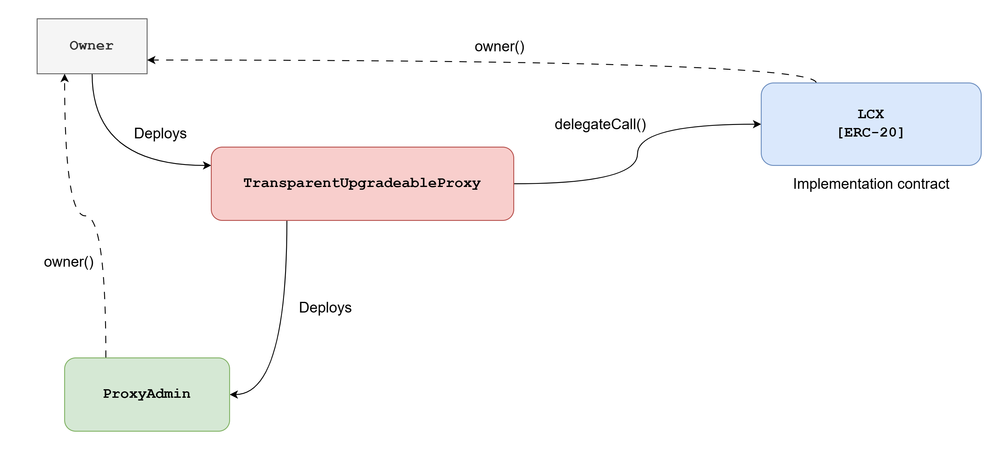
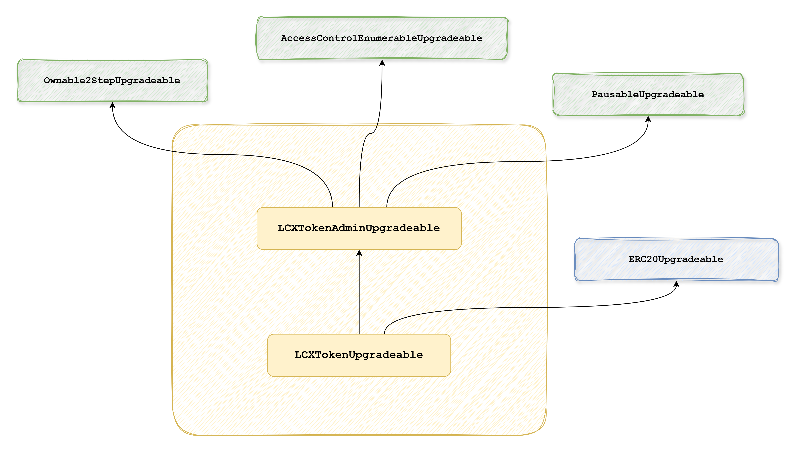
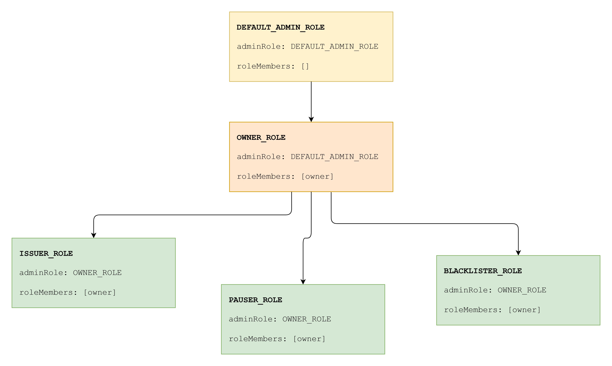

# LCX Token Smart Contract - Technical Documentation

LCX is an upgradeable **ERC-20 compliant token** designed with additional features like **strict supply management**, **permission-based token issuing**, **blacklisting** for compliance, and emergency **pausing** of issuing, transferring and burning of tokens.

See [LCX token contract](contracts/LCX.sol)

### Features

-   **ERC-20 Standard**:
    -   Implements all required ERC-20 functions, ensuring compatibility with wallets and dApps.
-   **Access Control**:
    -   The owner can assign multiple accounts with `ISSUER_ROLE`, `PAUSER_ROLE`, `BLACKLISTER_ROLE`
    -   Owner can be changed via. a safer 2-step process, where the nominated owner account has to accept ownership.
    -   The primary owner account would be a multi-sig wallet, for robust security.
-   **Permissioned Token Issuing**:
    -   Accounts with `ISSUER_ROLE` can issue tokens.
    -   Can easily be integrated with bridging contracts for cross-chain transfers.
-   **Burnable**:
    -   Implements `burn()` and `burnFrom()` utilizing allowance mechanism.
-   **Account blacklisting**:
    -   Accounts can be blacklisted, halting any token flow from / to / through them.
-   **Emergency pause**:
    -   Allows an account with `PAUSER_ROLE` to pause the contract, stopping all token flow (issue, transfer, burn)
-   **Upgradeable**:
    -   Implements **transparent upgradeable proxy** pattern.

## Technical Architecture

### Upgradeable Proxy Pattern



-   The contract deployment architecture is based on the **Transparent Upgradeable Proxy** pattern with a ProxyAdmin contract. Details can be found in OpenZeppelin docs.
-   The only difference here with **ProxyAdmin** is that it inherits **Ownable2Step** instead of Ownable as provided in the OpenZeppelin codebase.
-   A single `owner` account is used as the initial owner of both: the ERC-20 implementation contract (LCX) as well as the ProxyAdmin.
-   Deployment and upgrade demo can be found in `test/LCXToken.test.ts`: `describe("Deployment and upgrade")`

### Implementation Contract Logic

The implementation logic for the above proxy pattern is split across two Solidity contracts (excluding OpenZeppelin contracts), as described below:



**LCXAdmin**

`contracts/LCXAdmin.sol`

-   Manages the admin related functionalities for the token
-   Inherits `Ownable2StepUpgradeable`, `AccessControlEnumerableUpgradeable`, `PausableUpgradeable`
-   Manages access control with these access roles: `OWNER_ROLE`, `ISSUER_ROLE`, `PAUSER_ROLE`, `BLACKLISTER_ROLE`
-   Manages blacklisted addresses

**LCX**

`contracts/LCX.sol`

-   Manages the ERC-20 related functionalities of the token
-   Inherits `LCXAdmin`, `ERC20Upgradeable`
-   Has additional functions for issuing, burning, and increasing, decreasing allowance
-   As per OpenZeppelin's latest ERC-20 implementation, providing an allowance of `type(uint256).max` (i.e. `2 ** 256 - 1`) grants _infinite allowance_ to the spender

### Access Control

-   OpenZeppelin's role-based access control structure is used (AccessControlEnumerableUpgradeable)
-   There are four roles defined: `OWNER_ROLE`, `ISSUER_ROLE`, `PAUSER_ROLE`, `BLACKLISTER_ROLE`

The role hierarchy is demonstrated in this diagram:



-   Upon initialization, the `owner` is granted all roles, except `DEFAULT_ADMIN_ROLE`.

-   `DEFAULT_ADMIN_ROLE` is not included into the workflow. Only the contract owner should be able to manage the members of the three roles: `ISSUER_ROLE`, `PAUSER_ROLE`, and `BLACKLISTER_ROLE`. A member of `DEFAULT_ADMIN_ROLE` can add more members to `DEFAULT_ADMIN_ROLE`. So a different role - `OWNER_ROLE` - is introduced.

-   The contract owner is always assigned the `OWNER_ROLE`. When ownership changes, the new owner is granted the `OWNER_ROLE`, and the previous owner has it revoked. The owner cannot add more members to the `OWNER_ROLE`. This ensures that only one account has control over the members of `ISSUER_ROLE`, `PAUSER_ROLE`, and `BLACKLISTER_ROLE`.

-   To add or remove an account as, e.g. an issuer, `grantRole()` and `revokeRole()` functions can be used, respectively, like this:

    ```ts
    // ethers.js
    contract.connect(owner).grantRole(ISSUER_ROLE, account);
    contract.connect(owner).revokeRole(ISSUER_ROLE, account);

    // web3.js
    contract.methods.grantRole(ISSUER_ROLE, account).send({ from: owner });
    contract.methods.revokeRole(ISSUER_ROLE, account).send({ from: owner });
    ```

    It would work similarly for `PAUSER_ROLE` and `BLACKLISTER_ROLE`.

-   More test scenarios can be found in `test/LCXToken.test.ts`: `describe("Access control privileges")`

**Pausing the contract**

-   An account having `PAUSER_ROLE` can pause the contract; initially the contract owner only.
-   Pausing the contract pauses all issuing, transferring as well as burning.

**Blacklisting an account**

-   An account having `BLACKLISTER_ROLE` can blacklist (and un-blacklist) any account, by calling `addToBlacklist(account)` (and `removeFromBlacklist(account)`).
-   Blacklisting an account also revokes `ISSUER_ROLE`, `PAUSER_ROLE`, and `BLACKLISTER_ROLE` from it (although it is very unlikely that an account with some assigned role would be blacklisted).
-   When an account is blacklisted:
    -   tokens cannot be issued to that account.
    -   tokens cannot be transferred from / to that account.
    -   tokens cannot be burned from that account.
    -   it cannot transfer / issue / burn tokens to or from any other account. That means, for example, if a contract address is granted some token allowance, normally the contract can execute `transferFrom()`, but if that contract address gets blacklisted, it would not be able to execute `transferFrom()`, or `burnFrom()`.
